# PicoMuon_Python_code
Set of Python code to run on a RPi4/5 to get, process and present data from the UKRAA PicoMuon detector

I have written this software to suit my set-up, feel free use as you see fit.

## Requirements

The software needed to run will depend on what you intend.  You will need the following:

* Essential: [Python 3] (https://www.python.org/)
* Optional: [Pandas] for neutron data (https://pandas.pydata.org/)
* Optional: [gnuplot] for graphing processed data (http://www.gnuplot.info/)

## File structure

### scripts
```
└── 📁scripts
    └── 📁__pycache__
        └── nest.cpython-311.pyc
    └── DateTimeTest.py
    └── GetDataRaw.py
    └── GetDataRawACM0.py
    └── GetEnvironment.py
    └── GetNeutronData.py
    └── nest.py
    └── PlotMuonAdcACM0.gp
    └── PlotMuonCpmACM0.gp
    └── PlotMuonFreqACM0.gp
    └── ProcessMuonAdcACM0.py
    └── ProcessMuonCpmACM0.py
```

### data
```
└── 📁data
    └── 📁environment
        └── 📁2024
            └── 📁2024-10
                └── 2024-10-30.txt
        └── info.txt
    └── 📁neutrons
        └── 📁2024
            └── 📁2024-10
                └── 2024-10-30.txt
    └── 📁processed
        └── 📁adc
            └── 📁ACM0
                └── 📁2024
                    └── 📁2024-10
                        └── 2024-10-30.txt
        └── 📁cpm
            └── 📁ACM0
                └── 📁2024
                    └── 📁2024-10
                       └── 2024-10-30.txt
    └── 📁raw
        └── 📁ACM0
            └── 📁2024
                └── 📁2024-10
                   └── 2024-10-31.txt
```

### plots
```
└── 📁plots
    └── 📁adc
        └── 📁ACM0
          └── 2024-10-30_ADC_T_plot.png
    └── 📁cpm
        └── 📁ACM0
           └── 2024-10-30_CPM_T_plot.png
    └── 📁freq
        └── 📁ACM0
          └── 2024-10-30_Freq_T_plot.png
```

### temp
```
└── 📁temp
    └── ACM0_B-Adc.png
    └── ACM0_B-Cpm.png
    └── ACM0_B-Freq.png
    └── ACM0_C-Adc.png
    └── ACM0_C-Cpm.png
    └── ACM0_C-Freq.png
    └── ACM0_T-Adc.png
    └── ACM0_T-Cpm.png
    └── ACM0_T-Freq.png
```

## Using the code

The code assumes that you the UKRAA PicoMuon detector is connected to the RPi4/5 via USB and that it is /dev/ttyACM0 - you can check this by using "ls /dev/tty*" in a terminal window on the RPi4/5 and reviewing the response.  If different then ocurances of '/dev/ttyACM0' in GetDataRaw.py will need to be changed.

The code assumes user is "pi", if "pi" is not the user then need to change '/home/pi' to '/home/user' in the python and gnuplot scripts to whatever your username is.


The code assumes directory structure '/home/pi/UKRAA_muons/';
* ~ $ mkdir UKRAA_muons
* ~ $ cd UKRAA_muons
* ~/UKRAA_muons $ mkdir data plots scripts temp
* copy scripts from github to scripts folder
* modify as necessary

I run "GetDataRawACM0.py" as a service

I run the other python scripts from cron

## Set-up instructions

### Raspberry Pi OS

Download Raspberry Pi Imager for your operating system.
Web link https://www.raspberrypi.com/software/

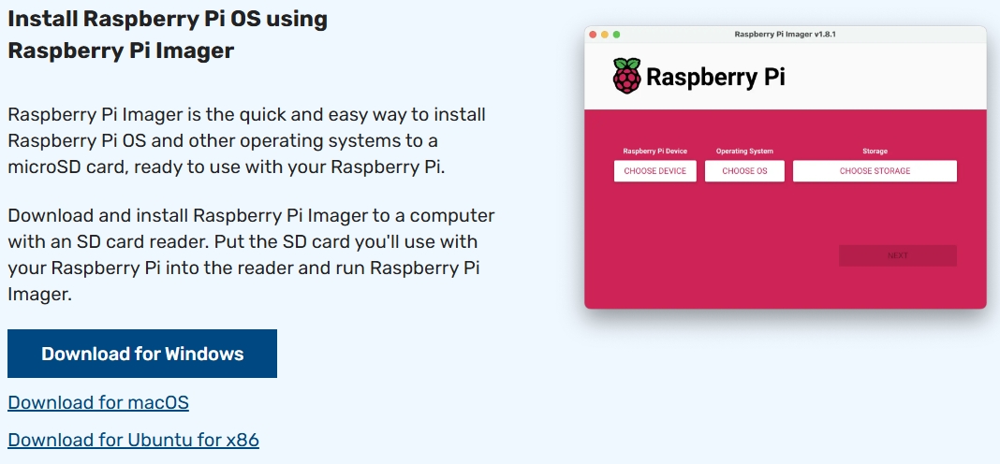

Run Raspberry Pi Imager.

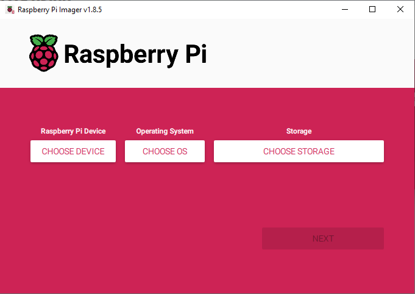

Select "CHOOSE DEVICE" and then select your Raspberry Pi device.

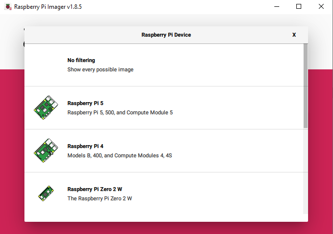

Select "CHOOSE OS" and then select "Raspberry Pi OS (64bit)".

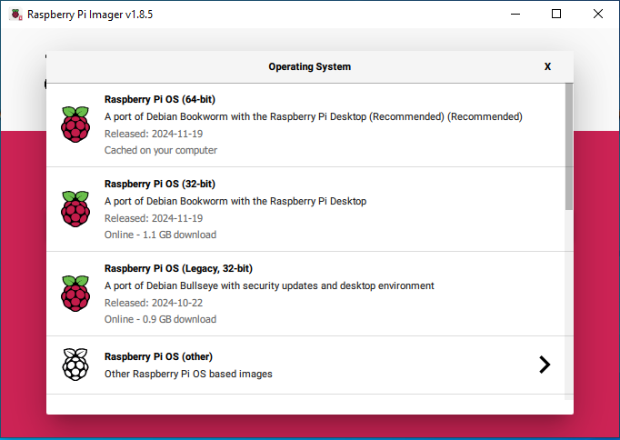

Select "CHOOSE STORAGE" and select your microSD card for your RPi.

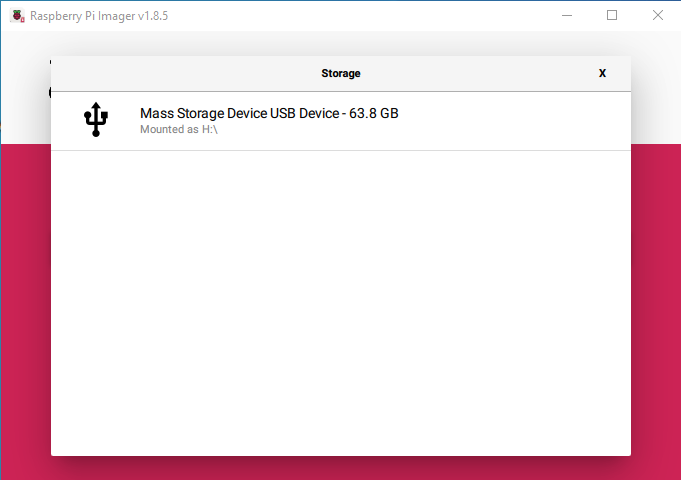

Select "NEXT"

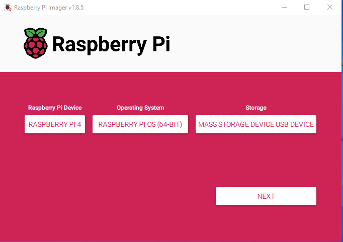

You are presented with a "Use OS customisation?" window, select "EDIT SETTINGS".

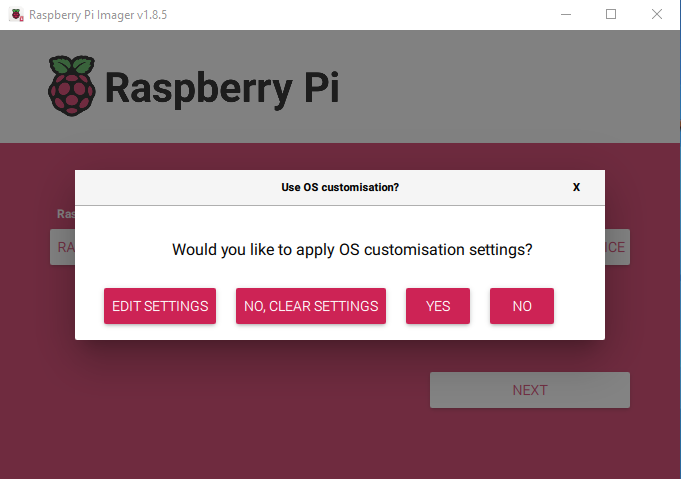


On the "GENERAL" page...

1. Set hostname - set to whatever you want - but write it down, we will need it latter!
2. Set username and password 
* Keep username as "pi"
* set your own password
3. Configure wireless LAN
* if you wish to use you RPi wirelessly
* Enter your wireless network's SSID, Password and Country
4. Set locale settings
* set timezone and keyboard to your preferences

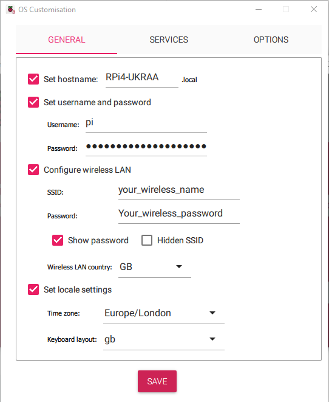

5. Select "SERVICES"
* Keep defaults

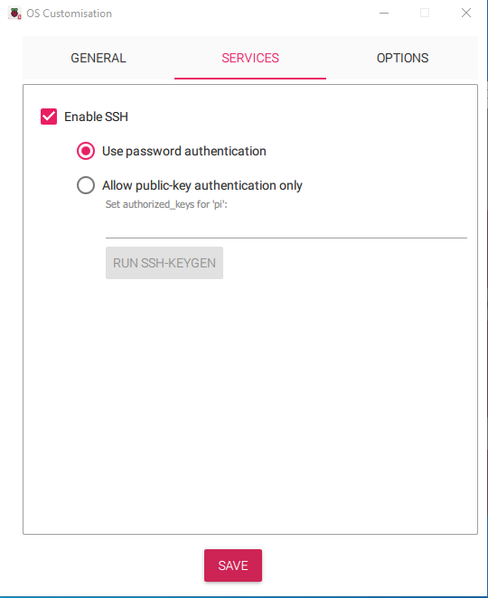

6. Select "OPTIONS"
* Keep defaults
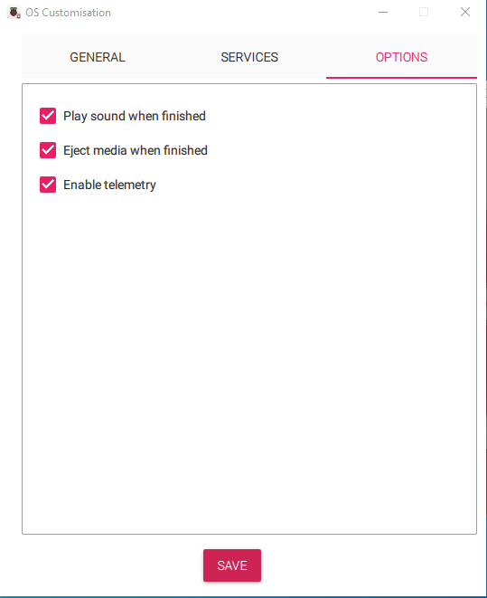

7. Select "SAVE"

Now apply the customised OS settings by selecting "YES".

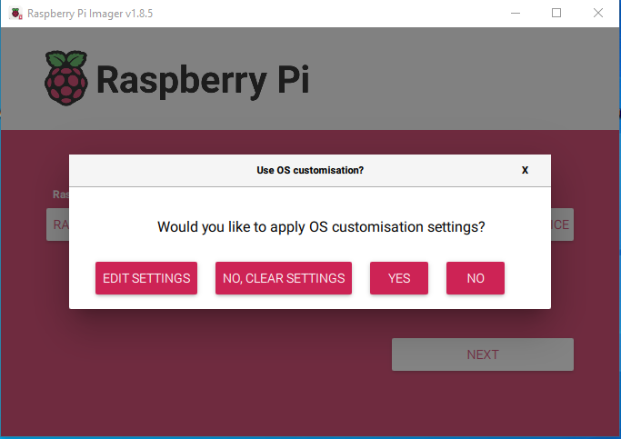

You will be asked if you wish to proceed, select "YES".

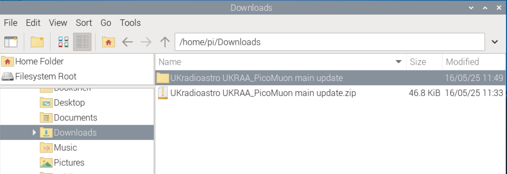

The operating system will now be written to the microSD card 

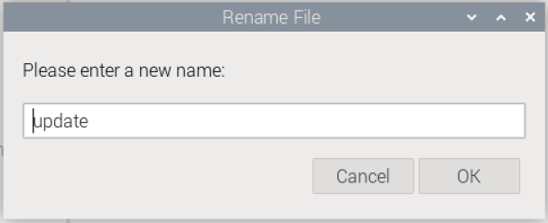

and then verified, this take a bit of time...

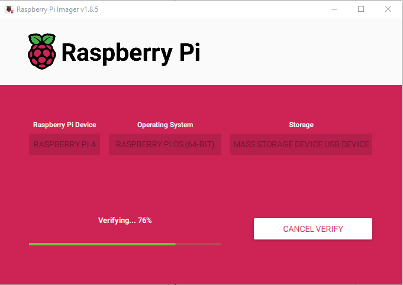

When finished, you can remove the microSD card and select "CONTINUE" and close the Raspberry Pi Imager.

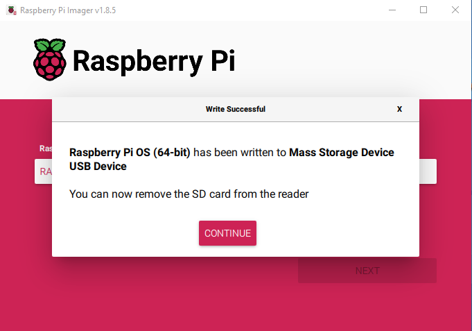.


### RPi4 configuration

Put the microSD card you have just created into your RPi4, connect the RPi to your LAN if necessary,  insert the power cable and turn on.

Using PuTTY (https://www.putty.org/)

In Host Name (or IP address), type the host name of your RPi that you wrote down earlier... and select open.

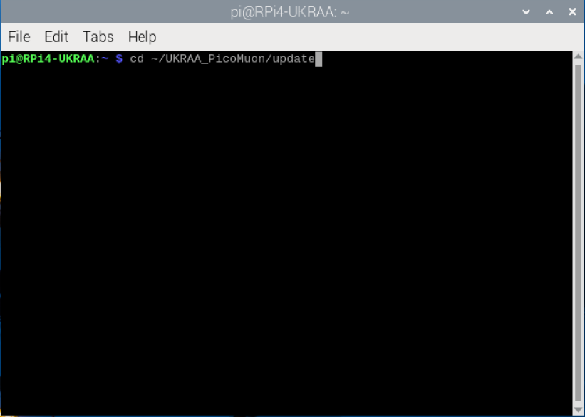


You will be presented with a PuTTY Security Alert - select "Accept".  You will now have a PuTTY terminal window.

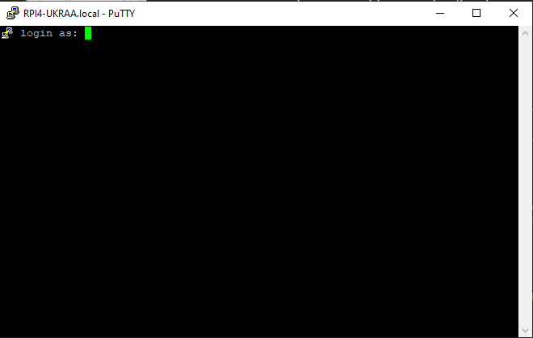

Login as "pi" and enter your password

Now type "sudo apt update" and hit enter.  This will update the RPi OS

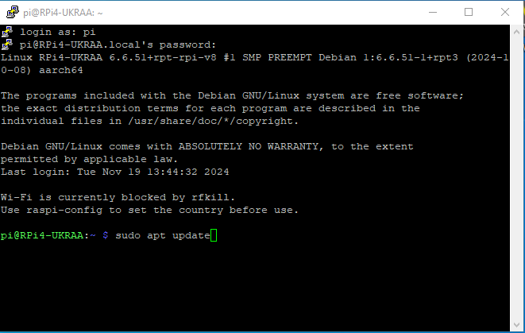

Now type "sudo apt upgrade" and hit enter.  This will update any preinstalled software packages.
You will be asked to type "y" to proceed.

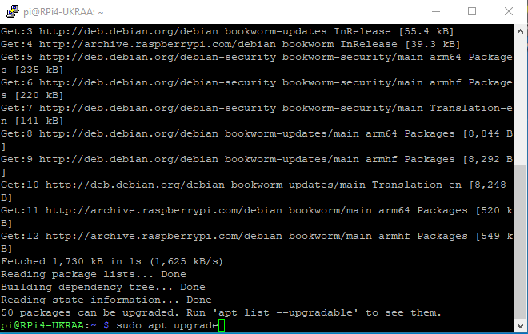

You may be advised that you can remove "no longer required" packages.  You can type "sudo apt autoremove" to do this. Again, you will be asked to type "y" to proceed.

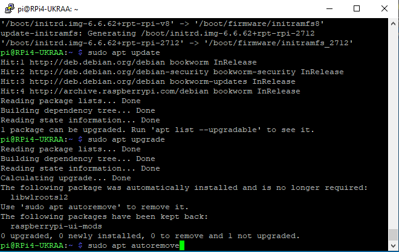

We can now set up VNC to access the RPi from our desktop PC.

Type "sudo raspi-config" and hit enter.  We will be presented with the RPi configuration tool.  Select "3 Interface Options".

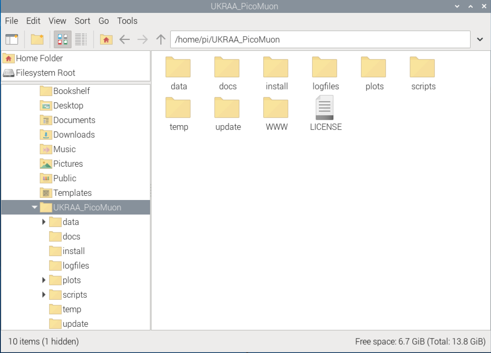

Now navigate down to "I3 VNC" and select

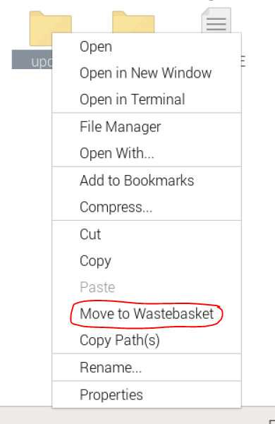

Select "<Yes>" to enable the VNC Server and hit enter.  

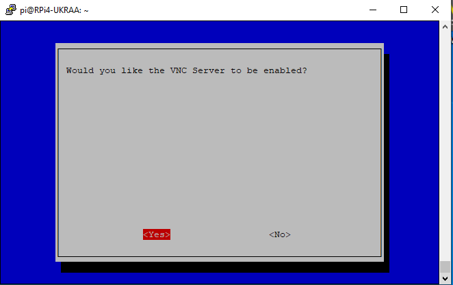

VNC server will now be enabled, hit enter.


Finish with the Configuration Tool by selectinf "<Finish>" and hit enter.

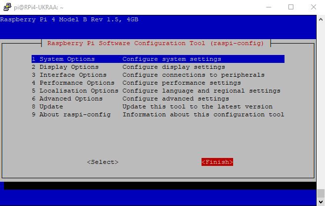

Reboot the RPi, type "sudo reboot" and hit enter.  This will close the PuTTY connection.  You can close the Putty window.

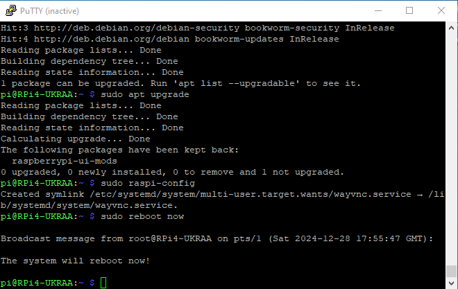


