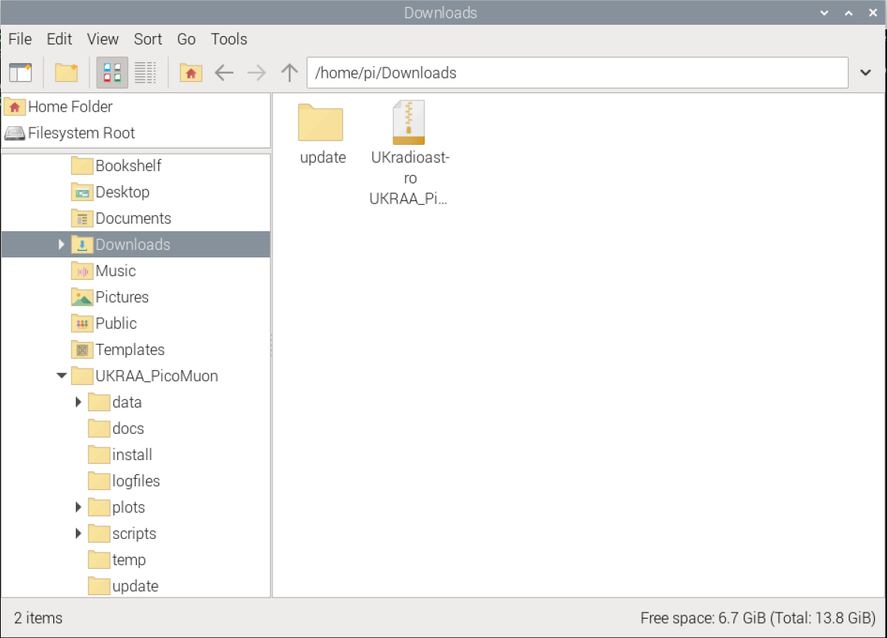
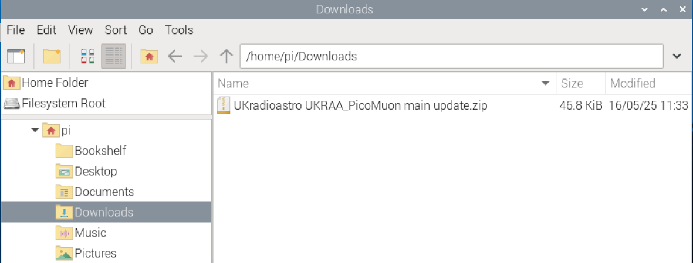

<div align=center>

</div>


# Python code for the UKRAA PicoMuon
[](/LICENSE)


Set of Python code to run on a RPi4/5 to get, process and present data from the UKRAA PicoMuon detector

This software was written to suit a specific set-up, feel free to use as you see fit.


Instructions for setting up a Raspberry Pi4/5 are included in the **docs** folder

---

&nbsp;
<!-- =============================================================================== --> 
## Contents

- [Can I update to latest version](#can-I-update-to-latest-version)
- [Where is my detector](#where-is-my-detector)
- [Using the code](#using-the-code) 
- [Getting the software onto your RPi](#getting-the-software-onto-your-RPi)
- [Installing the software onto your RPi](#installing-the-software-onto-your-RPi)
- [What does the code do](#what-does-the-code-do)
- [Check GetDataRawACM0 service is running](#check-GetDataRawACM0-service-is-running)
- [Updating your software](#updating-your-software)
- [License](#license)
- [Contact us](#contact-us)

&nbsp;

---

&nbsp;
<!-- =============================================================================== --> 
### Can I update to latest version

There is a section on updating your software to the latest version at the [bottom of this README](#updating-your-software).

[Back to Contents...](#contents)

&nbsp;

---

&nbsp;
<!-- =============================================================================== --> 
### Where is my detector

Plug your detector into any of the RPi USB ports - I normally use the blue ports (USB3).

1. Open a terminal window and type the following command and press enter
```
ls /dev/tty*
```


&nbsp;

2. You are looking for **/dev/ttyACM0** - this is on the right hand side of the screen shot above.

&nbsp;

3. This is the USB address for your attached detector - if you have more than one detector attached you may see **/dev/ttyACM1** etc.

&nbsp;

4. If you do not see **/dev/ttyACM0**, then unplug and plug the detector back in and try again.

&nbsp;

5. As long as you see **/dev/ttyACM0** then you do not have to make any changes to the python scripts, because they are looking for **ACM0**.

[Back to Contents...](#contents)

&nbsp;

---

&nbsp;
<!-- =============================================================================== --> 
## Using the code

The code assumes that your UKRAA PicoMuon detector is connected to the RPi4/5 via supplied USB cable and that it is /dev/ttyACM0 - you can check this by using **ls /dev/tty*** in a terminal window on the RPi4/5 and reviewing the response.

The code assumes one detector connected to the RPi4/5 USB and that it will be connected via **/dev/ttyACM0**, if there are other devices connected to the RPi and your detector is not **/dev/ttyACM0**, then you will need to change **/dev/ttyACM0** to **/dev/*ttyACMx*** in the **GetDataRawACM0.py** python script, where *ttyACMx* is the tty address of you connected detector.

**GetDataRawACM0.py** is run as a service.

Other scripts (Python, gnuplot and shell) are run from **cron**

[Back to Contents...](#contents)

&nbsp;

---

&nbsp;
<!-- =============================================================================== --> 
## Getting the software onto your RPi

1. Log into your Raspberry Pi4/5 using VNC.

&nbsp;

2. Open a terminal window, type the following command and press enter
```
git clone https://github.com/UKradioastro/UKRAA_PicoMuon
```


This will download all of the code to the directory **UKRAA_PicoMuon** inside **$HOME**

[Back to Contents...](#contents)

&nbsp;

---

&nbsp;
<!-- =============================================================================== --> 
## Installing the software onto your RPi


1. Open a terminal window and type the following command and press enter
```
cd ~/UKRAA_PicoMuon/install
```


This will take you to the **install** directory inside **$HOME/UKRAA_PicoMuon**


2. Type the following command and press enter
```
chmod +x *.sh
```


This will make the **install.sh** script executable.


3. Type the following command and press enter
```
sudo bash install.sh
```


This will run the install script.

There will be occasions during the running of the install script that require you to make a keyboard entry.

When asked **Do you want to continue? [Y/n]** - type **Y** or **y** and press **enter** 

During **mysql_secure_installation** you will be asked a number of questions.  

* Enter current password for root (enter for none): ------> press **enter**
* Switch to unix_socket authentication [Y/n] -------------> type **n** and press **enter**
* Change the root password? [Y/n] -----------------------> type **n** and press **enter**
* Remove anonymous users? [Y/n] -----------------------> type **y** and press **enter**
* Disallow root login remotely? [Y/n] ---------------------> type **y** and press **enter**
* Remove test database and access to it? [Y/n] ----------> type **y** and press **enter**
* Reload privilege tables now? [Y/n] ----------------------> type **y** and press **enter**

That's it!

The code is now set up to run automatically; it will get the data from the detector, process yesterdays data, plot yesterdays data and post yesterdays plots to your intranet web page once per day, at 9.30am in the morning.

[Back to Contents...](#contents)

&nbsp;

---

&nbsp;
<!-- =============================================================================== --> 
## What does the code do

The code receives the event data from the UKRAA PicoMuon detector via serial over the supplied USB cable and stores the event data to the raw data folder:

The raw data will be processed overnight, via CRON, to get counts per minute, the frequency of the counts per minute and the frequency of the adc values for your previous day's data.

A number of plots will be created:
* counts per minute
* frequency of counts per minute
* frequency of ADC values recorded

The raw data will also be processed overnight, via CRON, to produce % deviation of muon counts, this data is supplemented by a request  to [NMDB](https://www.nmdb.eu/) via NEST to get the previous days recorded neutron count, which will be overlaid onto the day / week / month / etc % deviation counts graphs.

These will appear as the required amount of data is recorded by the detector

A simple web server and web page is set up on your RPi so that you can view your detector's results on your desktop PC and/or smart phone when connected to your home network.

To access the webpage on your desktop PC or your smart phone…

1.	Open your preferred web application (Safari, Chrome, Firefox, etc.).

2.	In the search bar type the following and press enter
```
http://rpi4-UKRAA.local
```

This will take you to the web page for your detector, displaying yesterday’s events graphs.

NOTE: if you have a different **hostname** for your RPi, change the search bar entry to…

**http://_hostname_.local**

Where *hostname* is the hostname for your RPi setup.

[Back to Contents...](#contents)

&nbsp;

---

&nbsp;
<!-- =============================================================================== --> 
## Check GetDataRawACM0 service is running

1. To check the **status** of your service, type the following command and press enter.
```
sudo systemctl status PicoMuonACM0.service
```

&nbsp;

2. To **start** your service, type the following command and press enter.
```
sudo systemctl start PicoMuonACM0.service
```

&nbsp;

3. To **stop** your service, type the following command and press enter.
```
sudo systemctl stop PicoMuonACM0.service
```

&nbsp;

4. To **enable** your service, type the following command and press enter.
```
sudo systemctl enable PicoMuonACM0.service
```

&nbsp;

5. To **disable** your service, type the following command and press enter.
```
sudo systemctl disable PicoMuonACM0.service
```

[Back to Contents...](#contents)

&nbsp;

---

&nbsp;
<!-- =============================================================================== --> 
## Updating your software

1. Log into your Raspberry Pi4/5 using VNC.


2. We need to do a bit of house-keeping prior to installing the latest update...


3. Open **File Manager** and navigate to **$HOME/UKRAA_PicoMuon**. You should see something like the following.


4. Right mouse click on the **update** folder and select **Move to Wastebasket**


5. If you have undertaken a previous update open **File Manager** and navigate to **$HOME/Downloads**. You should see the file you previously downloaded.



6. Right mouse click on the **update** folder and select **Move to Wastebasket**


7. Right mouse click on the **UKradioastro zip folder** folder and select **Move to Wastebasket**


8. Open your web browser, type the following command into the URL window and press enter
```
https://download-directory.github.io/?url=https%3A%2F%2Fgithub.com%2FUKradioastro%2FUKRAA_PicoMuon%2Ftree%2Fmain%2Fupdate
```


This will download a zip file of the updated code to your RPi **$HOME/Downloads** folder.


Close your web browser.


9. Open **File Manager** and navigate to **$HOME/Downloads**. You should see the zip file you just downloaded.



10. Double click on the downloaded zip file **UKradioastro UKRAA_PicoMuon main update.zip**.  This will open the RPi **xarchiver** utility.


11. Now click on the **extract** icon on the menu ribbon.


12. Change **Extract to:** from **/tmp** to **$HOME/Downloads**, then click on the **Extract** button


Close the RPi xarchiver utility.

13. You should now see a new unzipped folder in the Downloads folder


14. Select **UKradioastro UKRAA_PicoMuon main update** folder and rename **update** (Right click mouse to bring up function).


15. Select the **update** folder and copy (Right click mouse to bring up function).

16. Navigate to the PicoMuon directory, **$HOME/UKRAA_PicoMuon**, and paste the **update** folder


Close the **File Manager** window

17. Open a terminal window and type the following command and press enter
```
cd ~/UKRAA_PicoMuon/update
```


This will take you to the **update** directory inside **$HOME/UKRAA_PicoMuon**

18. Type the following command and press enter
```
chmod +x *.sh
```


This will make the **update.sh** script executable.


19. Type the following command and press enter
```
sudo bash update.sh
```


This will run the update script.

20. That's it!  You should see the following...


The updated code is now set; it will get the data from the detector, process yesterdays data, plot yesterdays data and post yesterdays plots to your intranet web page once per day, at 9.30am in the morning.


[Back to Contents...](#contents)

&nbsp;

---

&nbsp;
<!-- =============================================================================== --> 
### License

MIT License

Copyright (c) 2024 UKRAA

Permission is hereby granted, free of charge, to any person obtaining a copy
of this software and associated documentation files (the **Software**), to deal
in the Software without restriction, including without limitation the rights
to use, copy, modify, merge, publish, distribute, sublicense, and/or sell
copies of the Software, and to permit persons to whom the Software is
furnished to do so, subject to the following conditions:

The above copyright notice and this permission notice shall be included in all
copies or substantial portions of the Software.

THE SOFTWARE IS PROVIDED **AS IS**, WITHOUT WARRANTY OF ANY KIND, EXPRESS OR
IMPLIED, INCLUDING BUT NOT LIMITED TO THE WARRANTIES OF MERCHANTABILITY,
FITNESS FOR A PARTICULAR PURPOSE AND NONINFRINGEMENT. IN NO EVENT SHALL THE
AUTHORS OR COPYRIGHT HOLDERS BE LIABLE FOR ANY CLAIM, DAMAGES OR OTHER
LIABILITY, WHETHER IN AN ACTION OF CONTRACT, TORT OR OTHERWISE, ARISING FROM,
OUT OF OR IN CONNECTION WITH THE SOFTWARE OR THE USE OR OTHER DEALINGS IN THE
SOFTWARE.

[Back to Contents...](#contents)

&nbsp;

---

&nbsp;
<!-- =============================================================================== --> 
### Contact us

Please send an e-mail to picomuon@ukraa.com

[Back to Contents...](#contents)

&nbsp;

---