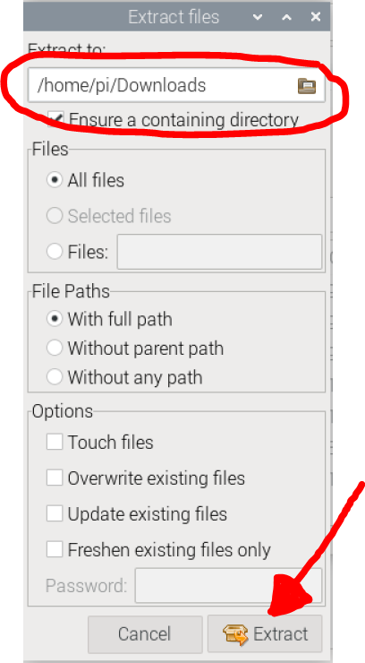
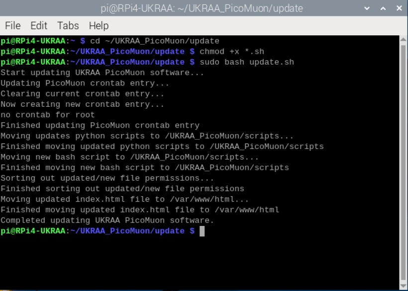
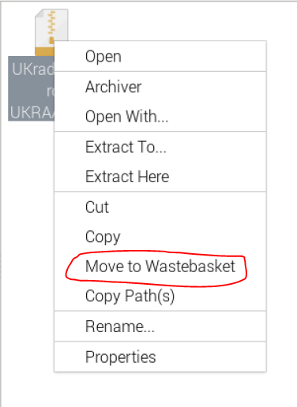
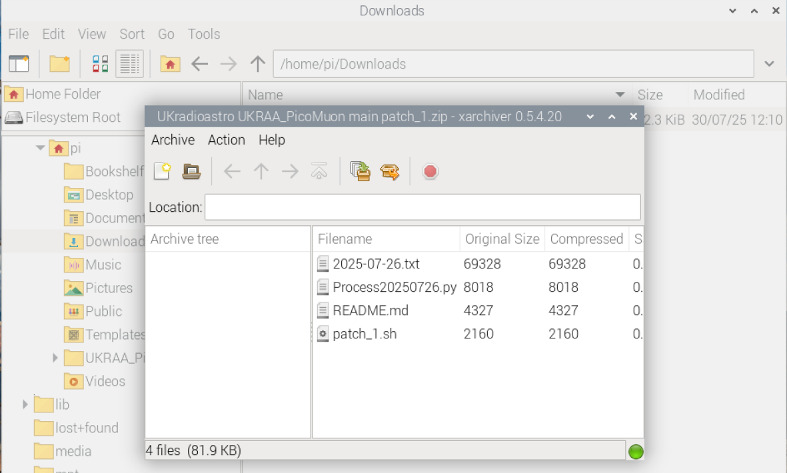
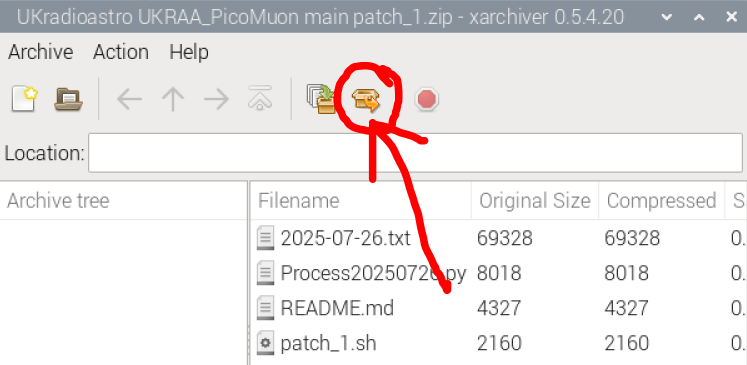
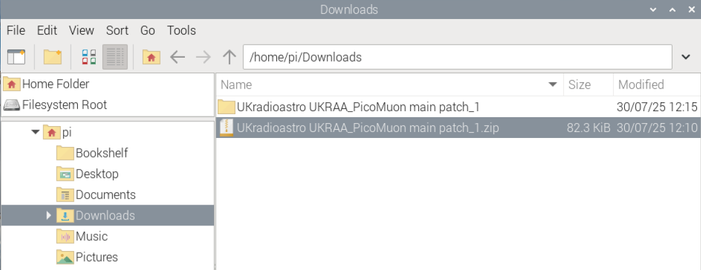

<div align=center>

</div>


# PicoMuon_Python_code
Set of Python code to run on a RPi4/5 to get, process and present data from the UKRAA PicoMuon detector

I have written this software to suit my set-up, feel free use as you see fit.

## Table of Contents

  - [Requirements](#Requirements)
  - [File structure](#file-structureile-structure)
    - [scripts](#scripts)
    - [data](#data)
    - [plots](#plots)
    - [temp](#temp)
    - [website](#website)
  - [Using the code](#using-the-codesing-the-code)
  - [Set-up instructions](#set-up-instructionset-up-instructions)
    - [Raspberry Pi OS](#raspberry-pi-os)
    - [RPi4 configuration](#rpi4-configuration)
    - [Headless access to RPi via VNC](#headless-access-to-rpi-via-vnc)
    - [Add additional software to your RPi](#add-additional-software-to-your-rpi)
    - [Get code from github](#get-code-from-github)
    - [Where is my detector?](#where-is-my-detector)
    - [Running the code to get data from the detector](#running-the-code-to-get-data-from-the-detector)
    - [Running the code to process and plot the data from the detector](#running-the-code-to-process-and-plot-the-data-from-the-detector)
    - [Creating simple home intranet web server on your RPi](#creating-simple-home-intranet-web-server-on-your-rpi)
    - [Creating simple website for your data](#creating-simple-website-for-you-picomuon-plots-to-view-your-results-on-your-smart-phome)
    - [Get daily plots to your website](#get-daily-plots-to-your-website)
  - [License](#License)
  - [Contact Us](#Contact-Us)

---

&nbsp;
<!-- =============================================================================== --> 
## Requirements

The software needed to run will depend on what you intend.  You will need the following:

* Essential: [Python 3](https://www.python.org/)
* Optional: [Pandas](https://pandas.pydata.org/) for neutron data 
* Optional: [gnuplot](http://www.gnuplot.info/) for graphing processed data 

---

&nbsp;
<!-- =============================================================================== --> 
## File structure

### scripts
```
└── 📁scripts
    └── 📁__pycache__
        └── nest.cpython-311.pyc
    └── DateTimeTest.py
    └── GetDataRaw.py
    └── GetDataRawACM0.py
    └── GetEnvironment.py
    └── GetNeutronData.py
    └── nest.py
    └── PlotMuonAdcACM0.gp
    └── PlotMuonCpmACM0.gp
    └── PlotMuonFreqACM0.gp
    └── ProcessMuonAdcACM0.py
    └── ProcessMuonCpmACM0.py
```

### data
```
└── 📁data
    └── 📁environment
        └── 📁2024
            └── 📁2024-10
                └── 2024-10-30.txt
        └── info.txt
    └── 📁neutrons
        └── 📁2024
            └── 📁2024-10
                └── 2024-10-30.txt
    └── 📁processed
        └── 📁adc
            └── 📁ACM0
                └── 📁2024
                    └── 📁2024-10
                        └── 2024-10-30.txt
        └── 📁cpm
            └── 📁ACM0
                └── 📁2024
                    └── 📁2024-10
                       └── 2024-10-30.txt
    └── 📁raw
        └── 📁ACM0
            └── 📁2024
                └── 📁2024-10
                   └── 2024-10-31.txt
```

### plots
```
└── 📁plots
    └── 📁adc
        └── 📁ACM0
          └── 2024-10-30_ADC_T_plot.png
    └── 📁cpm
        └── 📁ACM0
           └── 2024-10-30_CPM_T_plot.png
    └── 📁freq
        └── 📁ACM0
          └── 2024-10-30_Freq_T_plot.png
```

### temp
```
└── 📁temp
    └── ACM0_B-Adc.png
    └── ACM0_B-Cpm.png
    └── ACM0_B-Freq.png
    └── ACM0_C-Adc.png
    └── ACM0_C-Cpm.png
    └── ACM0_C-Freq.png
    └── ACM0_T-Adc.png
    └── ACM0_T-Cpm.png
    └── ACM0_T-Freq.png
```

### website
```
└── 📁WWW
    └── 📁images
        └── AndrewBanner.jpg
        └── Cosmic_muons.jpg
        └── favicon.ico
        └── PicoMuon_1.png
        └── PicoMuon_2.png
        └── PicoMuon_3.png
    └── 📁temp
        └── ACM0_B-Adc.png
        └── ACM0_B-Cpm.png
        └── ACM0_B-Freq.png
        └── ACM0_C-Adc.png
        └── ACM0_C-Cpm.png
        └── ACM0_C-Freq.png
        └── ACM0_T-Adc.png
        └── ACM0_T-Cpm.png
        └── ACM0_T-Freq.png
    └── index.html
```

---

&nbsp;
<!-- =============================================================================== --> 
## Using the code

The code assumes that you the UKRAA PicoMuon detector is connected to the RPi4/5 via USB and that it is /dev/ttyACM0 - you can check this by using **ls /dev/tty*** in a terminal window on the RPi4/5 and reviewing the response.

The code assumes user is **pi**, if **pi** is not the user then need to change '/home/pi' to '/home/user' in the python and gnuplot scripts to whatever your username is.

The code assumes one detector connected to RPi USB and will be **/dev/ttyACM0**, if there are other devices connected to the RPi and your detector is not **/dev/ttyACM0** then  then need to change '/dev/ttyACM0' to '/dev/ttyACMx' in the GetDataRaw.py python script.

**GetDataRawACM0.py** is run as a service

Other scripts (Python and gnuplot) are run from cron

---

&nbsp;
<!-- =============================================================================== --> 
## Set-up instructions

---

&nbsp;
<!-- =============================================================================== --> 
### Raspberry Pi OS

1. Download [Raspberry Pi Imager](https://www.raspberrypi.com/software/) for your operating system.


&nbsp;

2. Run Raspberry Pi Imager.


&nbsp;

3. Select **CHOOSE DEVICE** and then select your ***Raspberry Pi device**.


&nbsp;

4. Select **CHOOSE OS** and then select **Raspberry Pi OS (64bit)**.


&nbsp;

5. Select **CHOOSE STORAGE** and select your **microSD card** for your RPi.


&nbsp;

6. Select **NEXT**


&nbsp;

7. You are presented with a **Use OS customisation?** window, select **EDIT SETTINGS**.


&nbsp;

8. On the **GENERAL** page...

    - Set hostname - set to whatever you want - but write it down, we will need it latter!
    - Set username and password 
        - Keep username as **pi**
        - set your own password
    - Configure wireless LAN
        - if you wish to use you RPi wirelessly
        - Enter your wireless network's SSID, Password and Country
    - Set locale settings
        - set timezone and keyboard to your preferences


&nbsp;

9. Select **SERVICES**
* Keep defaults


&nbsp;

10. Select **OPTIONS**
* Keep defaults


&nbsp;

11. Select **SAVE**

&nbsp;

12. Now apply the customised OS settings by selecting **YES**.



&nbsp;

13. You will be asked if you wish to proceed, select **YES**.


&nbsp;

14. The operating system will now be written to the microSD card 


&nbsp;

15. and then verified, this take a bit of time...


&nbsp;

16. When finished, you can remove the microSD card and select **CONTINUE** and close the **Raspberry Pi Imager**.

.

&nbsp;

---

&nbsp;
<!-- =============================================================================== --> 
### RPi4 configuration

Put the microSD card you have just created into your RPi4, connect the RPi to your LAN if necessary,  insert the power cable and turn on.

Using PuTTY (https://www.putty.org/)

1. In Host Name (or IP address), type the host name of your RPi that you wrote down earlier... and select open.


&nbsp;

2. You will be presented with a PuTTY Security Alert - select **Accept**.  You will now have a PuTTY terminal window.


&nbsp;

3. Login as **pi** and enter your password

&nbsp;

4. Now type 
```
sudo apt update
```
and hit enter.  This will update the RPi OS


&nbsp;

5. Now type
```
sudo apt upgrade
```
and hit enter.  This will update any preinstalled software packages.  You will be asked to type **y** to proceed.



&nbsp;

6. You may be advised that you can remove **no longer required** packages.  You can type 
```
sudo apt autoremove
```
to do this. Again, you will be asked to type **y** to proceed.


&nbsp;

7. We can now set up VNC to access the RPi from our desktop PC. Type 
```
sudo raspi-config
```
and hit enter.  We will be presented with the RPi configuration tool.

&nbsp;

8. Select **3 Interface Options** and press return.


&nbsp;

9. Now navigate down to **I3 VNC** and press return.


&nbsp;

10. Select **Yes** to enable the VNC Server and hit enter.  


&nbsp;

11. VNC server will now be enabled, hit enter.


&nbsp;

12. Finish with the Configuration Tool by selecting **Finish** and hit enter.



&nbsp;

13. Reboot the RPi, type
```
sudo reboot
```
and hit enter.  This will close the PuTTY connection.  You can close the Putty window.


---

&nbsp;
<!-- =============================================================================== --> 
### Headless access to RPi via VNC

Using a VNC program like RealVNC (https://www.realvnc.com/en/), connect to your RPi...

Create a new connections and enter the hostname into the VNC Server box, add freindly name in the Name box and select okay.


Open this VNC connection to your RPi, you will get a **VNC server not recognised** window from RealVNC. Select **Continue**


You will now get an **Authentication** window from RealVNC, enter user and password details and select remember password to make it easier to login in future.


You are now remotely accessing your RPi...




---

&nbsp;
<!-- =============================================================================== --> 
### Add additional software to your RPi

We need to add some dependencies to the RPi.

1. pandas

Open a terminal window and type 
```
sudo apt install python3-pandas
```
and hit enter.  You will be asked to type **y** to proceed.  This will install pandas and other dependencies related to pandas.



2. gnuplot

Open the application menu (Raspberry) and select **Preferences** and **Add/Remove Software**.


From the **Add/Remove Software window type **gnuplot** into the search bar and hit enter.  When the available packages have been found select the packages in the following image and select **Apply**.



You will be asked to enter the pi password.  Enter your pi password and select **Authenticate**.  This will then install the gnuplot package and any dependencies required.


Select OK to close the window.


---

&nbsp;
<!-- =============================================================================== --> 
### Get code from github

Open the web browser on the RPi. In the address bar type 
```
https://github.com/UKradioastro/PicoMuon_Python_code
```
and press enter.


Select the **<> Code** tab and then select **Download ZIP**.  This will download all the necessary code/files for the Python code.  Close the web browser.


Open file manager and navigate to the **Downloads** folder - you should see a zip folder of the downloaded files.


Double click on the zip folder to bring up the extraction tool. Select the **extract files** to extract all the files in the zip folder.


You will be asked where you want the files to be extracted to - change the selection to the pi home directory.**  Close the extraction tool when finished.


From the open file manager navigate to /home/pi directory and you will see a new folder **PicoMuon_Python_code-main**.  Select this folder and right-click mouse and select **Rename**.


Change the name of the folder to **UKRAA_muons** and select **OK**.


Scripts and folder structure should now be in place to run the code.


---

&nbsp;
<!-- =============================================================================== --> 
### Where is my detector?.

Plug your detector into any of the RPI USB ports - I normally use the blue ports (USB3).

Open a terminal window and type 
```
ls /dev/tty*
```
and press enter.


You are looking for /dev/ttyACM0 - this will be on the RHS of the screen above.

This is the USB address for your attached detector - if you have more than one detector attached you may see /dev/ttyACM1 etc.

If you do not see /dev/ttyACM0, then unplug and plug the detector back in and try again.

As long as we see /dev/ttyACM0 then we do not have to make any changes to the python scripts, because they are looking for ACM0.

---

&nbsp;
<!-- =============================================================================== --> 
### Running the code to get data from the detector.

It is an easy process to set up services to run the code, check it is running and restart the code if it stps.

To do this we need to create the service, then enable the service.

1. Open terminal window
2. Type 
```
sudo nano /etc/systemd/system/muon_ACM0.service
```
and press enter - this will open nano text editor.
3. Type in the following text...
```
[Unit]
Description=start GetDataRawACM0.py
After=multi-user.target

[Service]
Type=idle
User=pi
ExecStart=/usr/bin/python3 /home/pi/UKRAA_muons/scripts/GetDataRawACM0.py
Restart=always
RestartSec=10

[Install]
WantedBy=multi-user.target

```

4. Save (Ctrl + s) and exit (Ctrl + x)
5. Type 
```
sudo chmod 644 /etc/systemd/system/muon_ACM0.service
```
and press enter - this will change permissions of your created service file and press enter.

6. Type 
```
sudo systemctl daemon-reload
```
and press enter - this will reload services.

7. Type 
```
sudo systemctl enable muon_ACM0.service
```
and press enter - this will enable your new service.


The service you have set will automatically start whenever the RPi is started or rebooted.

To check status of your service type:
```
sudo systemctl status muon_ACM0.service
```
and press enter.

We expect to see...


If we dont see green **enabled** and **active**, then we have a typo in the muon_ACM0.service file.

To start your service type:
```
sudo systemctl start muon_ACM0.service
```
and press enter.

To stop your service type:
```
sudo systemctl stop muon_ACM0.service
```
and press enter.


---

&nbsp;
<!-- =============================================================================== --> 
### Running the code to process and plot the data from the detector.

The data will be processed to get counts per minute and the frequency of the adc values for the previous day.

A request will be made to NEST to get the previous days recorded neutron count, this data will be overlayed onto the counts per minute graphs.

Three plots will be created:
* counts per minute
* frequency of counts per minute
* frequency of ADC values recorded

This can be done after midnight automatically using CRON because the processing of the cpm takes about 6 hours and the processing of the adc values takes about 1 hour on a RPi4.  It takes less time to run these two processes on a RPi5.

1. Open terminal window
2. Type **sudo crontab -e** and press enter - this will open crontab text editor.  The first time it will ask what editor you prefer - I prefer nano.


3. Scroll to bottom and type the following...
```
# m h  dom mon dow   command

# cron entry to get neutron data from NDB NEST
10 03 * * *  su pi -c **/usr/bin/python3 /home/pi/UKRAA_muons/scripts/GetNeutronData.py**

# cron entry to process yesterdays raw muon count rate
30 00 * * * su pi -c **/usr/bin/python3 /home/pi/UKRAA_muons/scripts/ProcessMuonCpmACM0.py**

# cron entry to process yesterdays raw muon adc values
45 00 * * * su pi -c **/usr/bin/python3 /home/pi/UKRAA_muons/scripts/ProcessMuonAdcACM0.py**

# cron entry to plot yesterdays count rate
55 07 * * * su pi -c **/usr/bin/gnuplot /home/pi/UKRAA_muons/scripts/PlotMuonCpmACM0.gp**

# cron entry to plot yesterdays count frequency
56 07 * * * su pi -c **/usr/bin/gnuplot /home/pi/UKRAA_muons/scripts/PlotMuonFreqACM0.gp**

# crom entry to plot yesterdays adc values
57 07 * * * su pi -c **/usr/bin/gnuplot /home/pi/UKRAA_muons/scripts/PlotMuonAdcACM0.gp**
```


4. Save (Ctrl + s) and exit (Ctrl + x).
5. If this went well you will see **crontab: installing new crontab** on the terminal window.

This should now process and graph yesterdays data from the detector overnight.

Plots will appear in the **plots** folder and the **temp** folder.

The **plots** folder hold plots for each day in year/month folder.

The **temp** folder only holds plots for yesterday, updated each day, for pushing to a website/etc.

---

&nbsp;
<!-- =============================================================================== --> 
### Creating simple home intranet web server on your RPi.

We can create a simple web server on our RPi to be able to view our detector results on our smart phone when connected to our home metwork.

To set up the web server on the RPi, follow the instruction from **tom's HARDWARE** (https://www.tomshardware.com/news/raspberry-pi-web-server,40174.html).  Only need to do first section - upto 9. Build your website.

---

&nbsp;
<!-- =============================================================================== --> 
### Creating simple website for you PicoMuon plots to view your results on your smart phome.

Once you have completed building your RPi web server, we need to move some files over to the /var/www/html folder, these are all located in the WWW folder from your downloaded git zip file - as shown below.


```
└── 📁WWW
    └── 📁images
        └── AndrewBanner.jpg
        └── Cosmic_muons.jpg
        └── favicon.ico
        └── PicoMuon_1.png
        └── PicoMuon_2.png
        └── PicoMuon_3.png
    └── 📁temp
        └── ACM0_B-Adc.png
        └── ACM0_B-Cpm.png
        └── ACM0_B-Freq.png
        └── ACM0_C-Adc.png
        └── ACM0_C-Cpm.png
        └── ACM0_C-Freq.png
        └── ACM0_T-Adc.png
        └── ACM0_T-Cpm.png
        └── ACM0_T-Freq.png
    └── index.html
```

1. Open terminal window
2. Type **cd UKRAA_muons/WWW/** and press enter - this will take you to the files in the WWW folder.  


3. We can check we are in the coorect location by typing **ls -l** and press enter, we should see the following...


4. We now need to copy the files and folders from WWW to /var/www/html.

5. Type **sudo cp index.html /var/www/html/index.html** and press enter.


6. Type **sudo cp -r images /var/www/html/** and press enter.


7. Type **sudo cp -r temp /var/www/html/** and press enter.


8. File manager, you can check that the file/folders have been copied correctly by navigating to /var/www/html and you should see the folowing.


9. You should now be able to access the webpage from your smart phone.  On your smart phone open your preferred web application (Safari, chrome, etc..). In the search bar type **http://rpi4-ukraa.local** and press enter - should access the web page.


---

&nbsp;
<!-- =============================================================================== --> 
### Get daily plots to your website.

The data on the website is static - we need to push the daily plots to the website so that they can be updated and viewed.

This can be done after the plots are completed automatically using CRON.

1. Open terminal window
2. Type 
```
sudo crontab -e
```
and press enter - this will open crontab text editor.  
3. Scroll to bottom and type the following after what you had previously typed in above...

```
# cron entry to upload plot files to www
00 08 * * * cp -r /home/pi/UKRAA_muons/temp /var/www/html/
```


4. Save (Ctrl + s) and exit (Ctrl + x).
5. If this went well you will see **crontab: installing new crontab** on the terminal window.

This should copy yesterdays plots at 8.00am each morning to the website for viewing.


---

&nbsp;
<!-- =============================================================================== --> 
### License

MIT License

Copyright (c) 2024 UKRAA

Permission is hereby granted, free of charge, to any person obtaining a copy
of this software and associated documentation files (the **Software**), to deal
in the Software without restriction, including without limitation the rights
to use, copy, modify, merge, publish, distribute, sublicense, and/or sell
copies of the Software, and to permit persons to whom the Software is
furnished to do so, subject to the following conditions:

The above copyright notice and this permission notice shall be included in all
copies or substantial portions of the Software.

THE SOFTWARE IS PROVIDED **AS IS**, WITHOUT WARRANTY OF ANY KIND, EXPRESS OR
IMPLIED, INCLUDING BUT NOT LIMITED TO THE WARRANTIES OF MERCHANTABILITY,
FITNESS FOR A PARTICULAR PURPOSE AND NONINFRINGEMENT. IN NO EVENT SHALL THE
AUTHORS OR COPYRIGHT HOLDERS BE LIABLE FOR ANY CLAIM, DAMAGES OR OTHER
LIABILITY, WHETHER IN AN ACTION OF CONTRACT, TORT OR OTHERWISE, ARISING FROM,
OUT OF OR IN CONNECTION WITH THE SOFTWARE OR THE USE OR OTHER DEALINGS IN THE
SOFTWARE.


---

&nbsp;
<!-- =============================================================================== --> 
### Contact us

Please send an e-mail to picomuon@ukraa.com