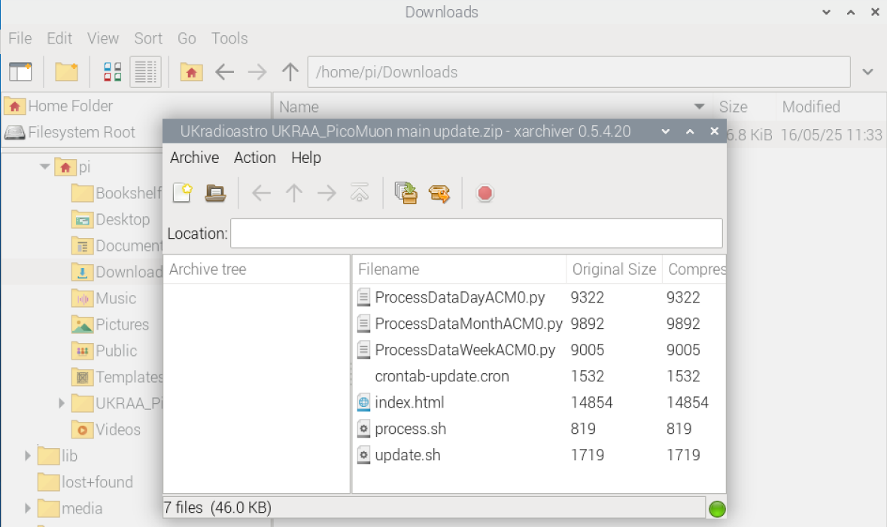
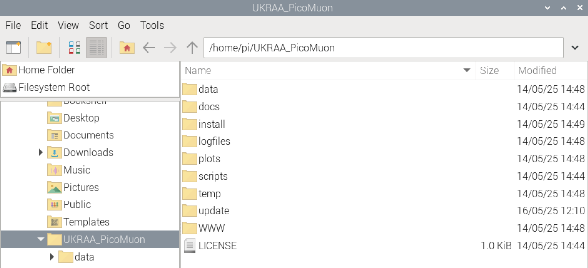
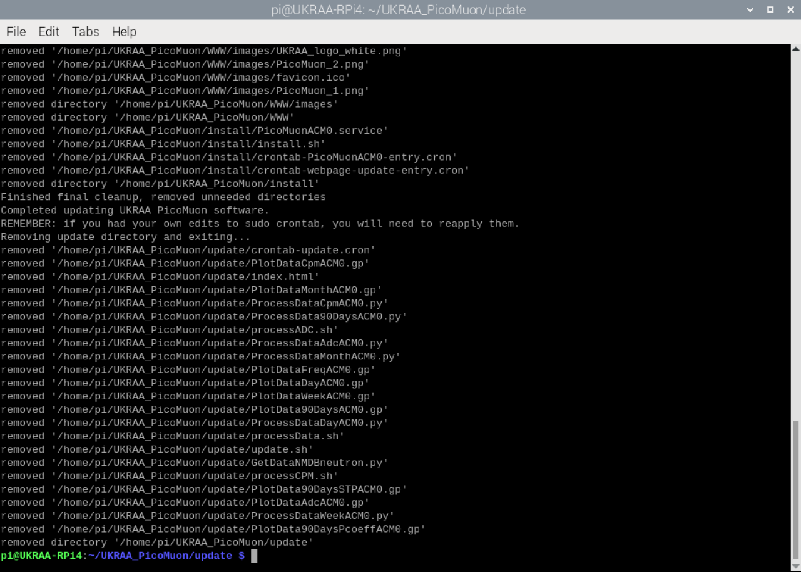

<div align=center>

</div>


# Patch#1 for the UKRAA PicoMuon
[](/LICENSE)


Set of code to patch missing NMDB data from 26/July/2025

This software was written to suit a specific set-up, feel free to use as you see fit.

---

&nbsp;

<!-- =============================================================================== --> 
## Installing the patch

1. Log into your Raspberry Pi4/5 using VNC.

2. Open your web browser, type the following command into the URL window and press enter
```
https://download-directory.github.io/?url=https%3A%2F%2Fgithub.com%2FUKradioastro%2FUKRAA_PicoMuon%2Ftree%2Fmain%2Fpatch_1
```


This will download a zip file of the updated code to your RPi **/home/pi/Downloads** folder.


Close your web browser.


3. Open **File Manager** and navigate to **/home/pi/Downloads**. You should see the zip file you just downloaded.


10. Double click on the downloaded zip file **UKradioastro UKRAA_PicoMuon main patch_1.zip**.  This will open the RPi **xarchiver** utility.



11. Now click on the **extract** icon on the menu ribbon.


12. Change **Extract to:** from **/tmp** to **/home/pi/Downloads**, then click on the **Extract** button


Close the RPi xarchiver utility.

13. You should now see a new unzipped folder in the Downloads folder


14. Select **UKradioastro UKRAA_PicoMuon main patch_1** folder and rename **patch_1** (Right click mouse to bring up function).


15. Select the **patch_1** folder and copy (Right click mouse to bring up function).

16. Navigate to the PicoMuon directory, **/home/pi/UKRAA_PicoMuon**, and paste the **patch_1** folder



Close the **File Manager** window

17. Open a terminal window and type the following command and press enter
```
cd ~/UKRAA_PicoMuon/patch_1
```


This will take you to the **patch_1** directory inside **/home/pi/UKRAA_PicoMuon**

18. Type the following command and press enter
```
chmod +x *.sh
```


This will make the **patch_1.sh** script executable.


19. Type the following command and press enter
```
sudo bash patch_1.sh
```


This will run the patch script.
The patch script will take about 90 minutes on a Raspberry Pi 4 and about 20 minutes on a Raspberry Pi 5.

20. That's it!  You should see the following...



The patch is now set; it will populate correct NMDB data for 26th July 2025 and process the day data for 26th July 2025.
No changes have been made to the week or month data files.
As these are next processed you should see corrected data in these plots when they are posted to your intranet web page at 9.30am in the morning.


&nbsp;

---

&nbsp;
<!-- =============================================================================== --> 
### License

MIT License

Copyright (c) 2024 UKRAA

Permission is hereby granted, free of charge, to any person obtaining a copy
of this software and associated documentation files (the **Software**), to deal
in the Software without restriction, including without limitation the rights
to use, copy, modify, merge, publish, distribute, sublicense, and/or sell
copies of the Software, and to permit persons to whom the Software is
furnished to do so, subject to the following conditions:

The above copyright notice and this permission notice shall be included in all
copies or substantial portions of the Software.

THE SOFTWARE IS PROVIDED **AS IS**, WITHOUT WARRANTY OF ANY KIND, EXPRESS OR
IMPLIED, INCLUDING BUT NOT LIMITED TO THE WARRANTIES OF MERCHANTABILITY,
FITNESS FOR A PARTICULAR PURPOSE AND NONINFRINGEMENT. IN NO EVENT SHALL THE
AUTHORS OR COPYRIGHT HOLDERS BE LIABLE FOR ANY CLAIM, DAMAGES OR OTHER
LIABILITY, WHETHER IN AN ACTION OF CONTRACT, TORT OR OTHERWISE, ARISING FROM,
OUT OF OR IN CONNECTION WITH THE SOFTWARE OR THE USE OR OTHER DEALINGS IN THE
SOFTWARE.

&nbsp;

---

&nbsp;
<!-- =============================================================================== --> 
### Contact us

Please send an e-mail to picomuon@ukraa.com

&nbsp;

---